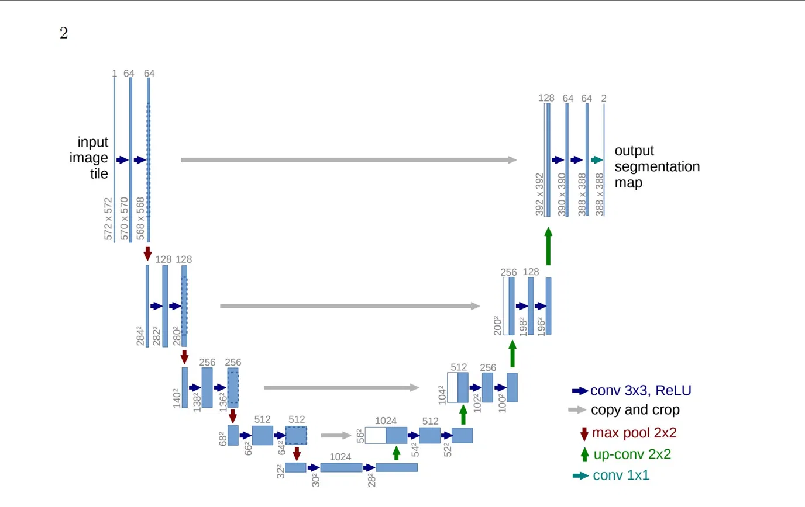

# UNET — One Read, One Implement (PyTorch)

A clean from-scratch PyTorch reimplementation of the U-Net architecture for binary image segmentation, built while reading the original paper.

> Ronneberger, O., Fischer, P., & Brox, T. (2015). [U-Net: Convolutional Networks for Biomedical Image Segmentation](https://arxiv.org/abs/1505.04597). MICCAI 2015.

---

## Architecture



The network follows the original encoder-decoder design with skip connections:

- **Contracting path** — 4 blocks of (Conv 3×3 → ReLU → Conv 3×3 → ReLU → MaxPool 2×2), doubling channels at each step
- **Bottleneck** — two convolutions at the deepest representation (1024 channels)
- **Expansive path** — 4 blocks of (UpConv 2×2 → concat skip → Conv 3×3 → ReLU → Conv 3×3 → ReLU), halving channels at each step
- **Output** — 1×1 convolution mapping to `num_classes` channels

Key deviation from the paper: `padding=1` on all 3×3 convolutions (same convolution) to preserve spatial dimensions, removing the need for skip connection cropping.

---

## Dataset

**Oxford-IIIT Pet Dataset** — 7,349 images of 37 pet breeds with pixel-level trimap annotations.

| Split | Size |
|-------|------|
| trainval | 3,680 |
| test | 3,669 |

Trimap values `{1, 2, 3}` (foreground / background / boundary) are remapped to binary masks: foreground = 1, everything else = 0.

---

## Results

| Metric | Value |
|--------|-------|
| IoU | 0.7790 |
| Dice | 0.3638 |

### Inference Sample


*Left: input image — Center: ground truth mask — Right: predicted mask*

---

## Project Structure

```
UNET-one-read-one-implement-Pytorch/
├── assets/
│   ├── unet_architecture.png
│   └── inference_result.png
├── unet.ipynb
└── README.md
```

---

## Setup

```bash
git clone https://github.com/shakhsm123/UNET-one-read-one-implement-Pytorch.git
cd UNET-one-read-one-implement-Pytorch
pip install torch torchvision matplotlib
```

---

## Usage

Open `unet.ipynb` and run cells top to bottom. The notebook covers:

1. Dataset loading (auto-downloads Oxford-IIIT Pet via torchvision)
2. Model definition — `ContractionNetwork`, `ExpansionNetwork`, `UNET`
3. Training loop with combined BCE + Dice loss
4. Evaluation with IoU metric
5. Inference and visualization

---

## Training Details

| Hyperparameter | Value |
|----------------|-------|
| Optimizer | Adam |
| Learning rate | 1e-4 |
| Batch size | 16 |
| Loss | BCE with Logits + Dice |
| LR scheduler | ReduceLROnPlateau (patience=5) |
| Input size | 256 × 256 |
| Output channels | 1 (binary segmentation) |
| Epochs | 150 |

---

## Reference

```bibtex
@inproceedings{ronneberger2015unet,
  title     = {U-Net: Convolutional Networks for Biomedical Image Segmentation},
  author    = {Ronneberger, Olaf and Fischer, Philipp and Brox, Thomas},
  booktitle = {Medical Image Computing and Computer-Assisted Intervention (MICCAI)},
  year      = {2015}
}
```
